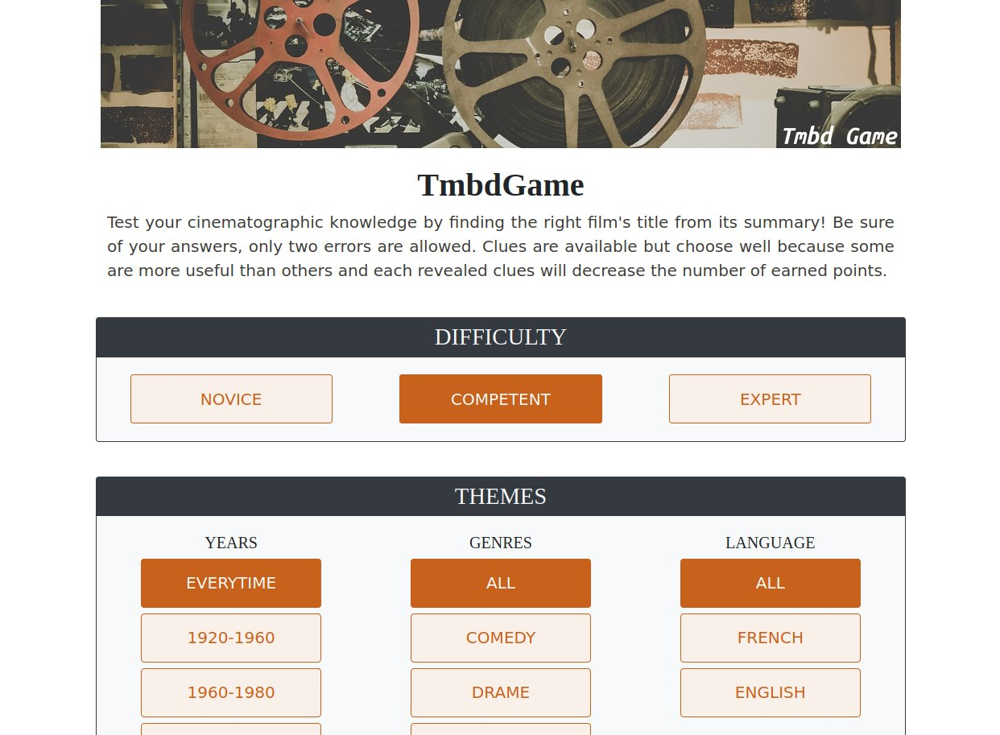

# TmbdCineGame

**Developed by:** Justin Foltz

**Date :** 12.2018

## The project

TmbdCineGame is a web application in the form of a cinematic quiz. The game is organized around questions made up of a film summary and several title proposals. The goal is to find the title corresponding to the displayed summary. Four clues related to the context of the film can be revealed by the user if he feels the need. For each correct answer, the score is incremented by 1 to 5 points according to the number of clues revealed (-1 point per clue revealed). The game ends after 10 questions or after 2 wrong answers. To vary the games, the user can, at the beginning of the game, filter by genre, years, or language, the films that will be presented to him. In addition, he can choose between three modes of increasing difficulty: extra, assistant or director, directly linked to the number of proposals that will be made (respectively 2, 4 or none). 



## Technologies

* [Angular CLI](https://github.com/angular/angular-cli) version 7.0.2. 
* [API TMBD](https://developers.themoviedb.org/3/getting-started/introduction) : provide films data

## How to run the project ?

### Requirement

[Angular CLI](https://github.com/angular/angular-cli) version 7.0.2. must be installed.

### Running the project

1. Clone the repository

2. Get a [TMBD API KEY](https://developers.themoviedb.org/3/getting-started/introduction) and add it to `src/app/jeu.service.ts`  :

   ```typescript
   19   private APIKEY: string = "your api key";
   ```

3. In project root folder, run the below command : 

   ```bash
   ng serve --open
   ```

   

   